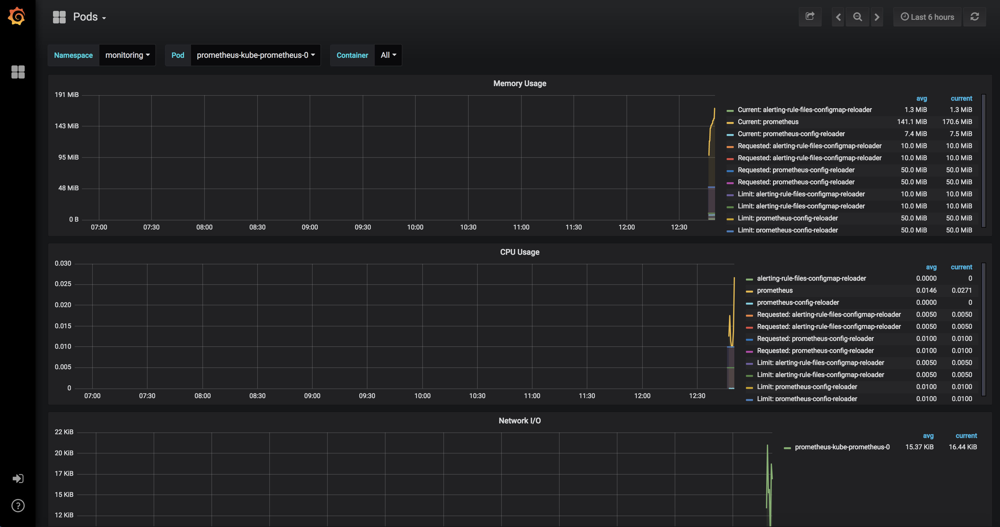

## Installing OpenSourceLANParty K8s Monitoring Stack

### Helm Setup
```bash
curl https://raw.githubusercontent.com/helm/helm/master/scripts/get | bash
helm init
kubectl get pods --namespace kube-system
```
You should now see Tiller (server portion of Helm) running in the kube-system namespace.

```
NAME                                         READY     STATUS    RESTARTS   AGE
etcd-docker-for-desktop                      1/1       Running   0          17d
kube-apiserver-docker-for-desktop            1/1       Running   0          17d
kube-controller-manager-docker-for-desktop   1/1       Running   0          17d
kube-dns-86f4d74b45-59hkj                    3/3       Running   0          17d
kube-proxy-qrmnw                             1/1       Running   0          17d
kube-scheduler-docker-for-desktop            1/1       Running   0          17d
kubernetes-dashboard-7b9c7bc8c9-zbcw2        1/1       Running   1          17d
tiller-deploy-67d8b477f7-wqrcd               1/1       Running   0          17d
```

### Add CoreOS Helm Repo
This is required as CoreOS maintains the Prometheus-Operator for K8s.
```bash
helm repo add coreos https://s3-eu-west-1.amazonaws.com/coreos-charts/stable/
```

### Deploy Prometheus Operator Chart
This will create a Helm deployment for the Prometheus-operator which installs a bunch of K8s CustomResourceDefinitions (CRDs) that will be used to manage Prometheus from the K8s constructs it creates.

We're installing this into the monitoring namespace as that's where all our stack is going to live.

```bash
helm install coreos/prometheus-operator --name prometheus-operator --namespace monitoring
```

This should create several k8s resources.
```
# kubectl get all -n monitoring
NAME                                     READY     STATUS    RESTARTS   AGE
pod/prometheus-operator-d75587d6-r62lx   1/1       Running   0          1m

NAME                                  DESIRED   CURRENT   UP-TO-DATE   AVAILABLE   AGE
deployment.apps/prometheus-operator   1         1         1            1           1m

NAME                                           DESIRED   CURRENT   READY     AGE
replicaset.apps/prometheus-operator-d75587d6   1         1         1         1m
```

### Deploy Prometheus Chart
Next is the kube-prometheus deployment which will actually do the work for it. This will setup a full Prometheus stack including node exporters for each worker, kubelet monitors and service checks for the K8s stack.
```
user@master$ helm install coreos/kube-prometheus --name kube-prometheus --namespace monitoring
```

Once again, this should create a bunch of resources including daemon sets for node exporters.

We can check on our Helm deployments:
```
user@master$ helm ls
NAME               	REVISION	UPDATED                 	STATUS  	CHART                     	APP VERSION	NAMESPACE
kube-prometheus    	1       	Mon Sep 17 22:02:21 2018	DEPLOYED	kube-prometheus-0.0.105   	           	monitoring
prometheus-operator	1       	Mon Sep 17 21:59:51 2018	DEPLOYED	prometheus-operator-0.0.29	0.20.0     	monitoring
```

As of this moment, we have a half-decent monitoring stack that is collecting data for the Kubernetes cluster (nodes, pods deployments and system metrics):


### Deploy InfluxDB
Once again, a Helm Chart makes this easy:
```
user@master$ helm install stable/influxdb --name kube-influxdb --namespace monitoring -f influxdb-values.yaml
```

### Deploy Telegraf for Blackbox Testing
```
user@master$ helm repo add influx http://influx-charts.storage.googleapis.com
```

### Provision Grafana Resources
Provision Grafana datasources and dashbboards within the grafana-resources
```
user@master$ ./scripts/provision-grafana.sh -h grafana.monitoring.svc.cluster.local -u admin -p admin -r ./grafana-resources/*
```

### Deploy LibreNMS Chart
```
user@master$ helm install ./helm-librenms --name librenms --namespace monitoring -f ./helm-values/librenms-values.yaml
```


